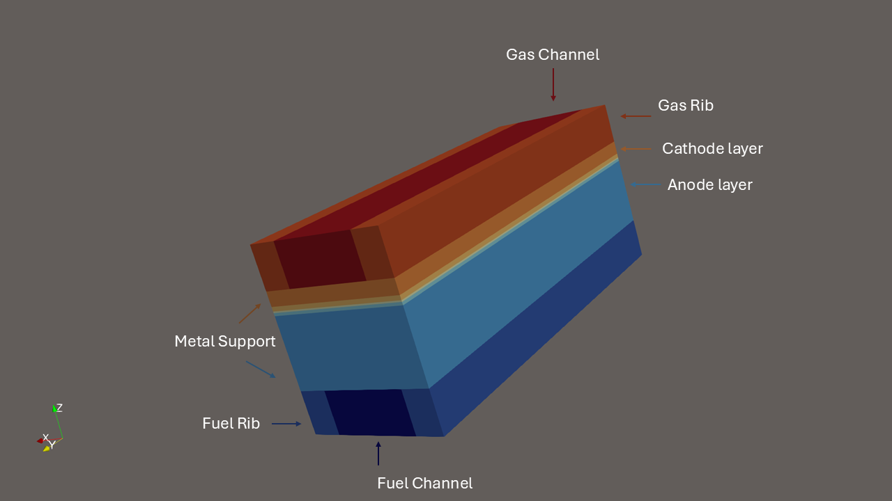

# The Effect of Metal Suport Degradation on the Performance of Solid Oxide Fuel Cell

# Introduction

This project develops a three-dimensional FEniCSx/DOLFINx model of a counter-flow MS-SOFC to study how oxidation of the porous metal support affects cell performance. The model couples gas transport, porous-media diffusion, electrochemical reaction, electric-potential transport, heat generation, and material-property degradation. The main goal is to quantify how degradation changes current density, voltage, power density, gas concentration, temperature, effective diffusivity, porosity, tortuosity, and electronic conductivity.

# Model Setup

The geometry represents a layered MS-SOFC with fuel and air channels, ribs, a porous metal support, an anode functional layer, electrolyte, cathode functional layer, and cathode porous layer.

The model uses the following geometric dimensions:

| Quantity | Meaning | Value |
|---|---:|---:|
| $$w_{\mathrm{rib}}$$ | rib width | $$200~\mu\mathrm{m}$$ |
| $$w_{\mathrm{channel}}$$ | channel width | $$600~\mu\mathrm{m}$$ |
| $$L_x$$ | total width | $$1000~\mu\mathrm{m}$$ |
| $$L_y$$ | flow length | $$3000~\mu\mathrm{m}$$ |
| $$h_{\mathrm{fuel}}$$ | fuel channel height | $$300~\mu\mathrm{m}$$ |
| $$h_{\mathrm{MS}}$$ | metal support thickness | $$500~\mu\mathrm{m}$$ |
| $$h_{\mathrm{AFL}}$$ | anode functional layer thickness | $$20~\mu\mathrm{m}$$ |
| $$h_{\mathrm{EL}}$$ | electrolyte thickness | $$10~\mu\mathrm{m}$$ |
| $$h_{\mathrm{CFL}}$$ | cathode functional layer thickness | $$30~\mu\mathrm{m}$$ |
| $$h_{\mathrm{cathode}}$$ | cathode porous layer thickness | $$100~\mu\mathrm{m}$$ |
| $$h_{\mathrm{air}}$$ | air channel height | $$300~\mu\mathrm{m}$$ |

The fuel and air streams flow in opposite directions. Fuel enters from one end of the channel and air enters from the other end.

The main simulation is solved on two reduced submeshes:

| Submesh | Included regions | Main variables solved |
|---|---|---|
| Fuel submesh | Fuel channel, metal support, anode functional layer | Hydrogen, water vapor, metal fraction, fuel-side temperature, electronic potential |
| Air submesh | Air channel, cathode porous layer, cathode functional layer | Oxygen, air-side temperature, ionic/electrolyte-side potential |

The anode functional layer and cathode functional layer are coupled by matching nearby cells in the horizontal plane. This allows the model to calculate one shared local current density for the anode and cathode reaction at each location.

The operating temperature is

$$
T_0 = 1073.15~\mathrm{K}
$$

The inlet fuel gas is humidified hydrogen:

$$
x_{\mathrm{H_2,in}}=0.97
$$

$$
x_{\mathrm{H_2O,in}}=0.03
$$

The air inlet oxygen mole fraction is:

$$
x_{\mathrm{O_2,in}}=0.21
$$
# Governing Equations

## Gas transport

$$
\frac{\partial c}{\partial t}+\mathbf{u}_f\cdot\nabla c=\nabla\cdot\left(D_{\mathrm{C}}\nabla c\right)+S
$$

The model tracks hydrogen and water vapor on the fuel side, and oxygen on the air side.

Hydrogen is consumed by the electrochemical reaction in the anode functional layer. Water vapor is produced by the electrochemical reaction, but it is also consumed by the metal-support oxidation reaction. Oxygen is consumed in the cathode functional layer.

Gas transport includes both advection and diffusion. Advection moves species with the gas flow, while diffusion moves species from high concentration regions to low concentration regions.

## Porous-media transport

$$
D_{\mathrm{eff}}=D_{\mathrm{bulk}}\frac{\varepsilon}{\tau}
$$

The metal support and electrode layers are porous, so gas does not move through them as freely as it does in open channels. The model accounts for this by using effective transport properties based on porosity and tortuosity.

When oxidation progresses, the metal support becomes less porous and more tortuous. This reduces the effective diffusivity of hydrogen and water vapor, which makes it harder for fuel to reach the active reaction layer.

$$
D(T)=D_{\mathrm{ref}}\left(\frac{T}{T_0}\right)^{1.75}
$$

The model can also include a Maxwell-Stefan-inspired correction and Knudsen diffusion. This improves the gas transport description by accounting for gas mixture composition, temperature, and pore size.

## Darcy flow

$$
\nabla\cdot\left(\frac{K}{\mu}\nabla p\right)=0
$$

The model uses pressure-driven Darcy flow.

Pressure is prescribed at the fuel and air inlets and outlets. The model then calculates the pressure field and uses it to compute the Darcy velocity. This velocity is used in the gas and heat transport equations.

This makes gas movement depend on permeability, viscosity, and pressure gradients. Since oxidation changes pore size and porosity, it also changes permeability and therefore affects gas flow.

## Metal-support oxidation

The model uses `theta_metal` to represent the remaining metallic fraction of the support.

- `theta_metal = 1` means fresh metallic support.
- `theta_metal = 0` means fully degraded support.

The oxidation degree is therefore `1 - theta_metal`.

In the current simplified model, oxidation is driven by local water vapor concentration. The oxidation reaction consumes water vapor and metal, and produces hydrogen. As oxidation proceeds, the remaining metal fraction decreases.

## Material degradation

Oxidation changes the material properties of the metal support.

As `theta_metal` decreases:

- porosity decreases,
- tortuosity increases,
- effective diffusivity decreases,
- pore radius decreases,
- permeability decreases,
- electronic conductivity decreases.

These changes create two main degradation pathways.

First, lower electronic conductivity increases electronic conduction loss and reduces local current. Second, lower porosity, diffusivity, and permeability weaken gas transport, which reduces local fuel availability and lowers electrochemical performance.

## Electronic and ionic potentials

$$
-\nabla\cdot\left(\sigma\nabla\phi\right)=q
$$

The model solves an electronic potential equation on the fuel submesh. This represents electron conduction through the metal support and anode-side conducting regions.

The model also solves a reduced ionic/electrolyte-side potential equation on the air submesh. This is used to represent the cathode-side/electrolyte-side potential involved in the local electrochemical reaction.

The difference between ionic and electronic potential gives the local operating voltage used by the electrochemical model.

## Electrochemical current

$$
i_{\mathrm{loc}}=2i_0\sinh\left(\frac{\alpha F\eta_{\mathrm{act}}}{RT}\right)
$$

The local current density is calculated using a Butler-Volmer-type relationship.

The model first uses the local gas concentrations and temperature to calculate the local Nernst voltage. It then compares this reversible voltage with the local operating voltage from the potential fields. The difference gives the activation overpotential, which drives the local current.

The same local current is used on the anode and cathode side, so hydrogen consumption, water production, and oxygen consumption remain coupled.

## Heat generation and temperature

$$
\rho c_p\frac{\partial T}{\partial t}+\rho c_p\mathbf{u}_f\cdot\nabla T=\nabla\cdot\left(k\nabla T\right)+Q$$

The model solves temperature on both the fuel and air submeshes.

Heat is generated from electrochemical losses. Larger current density and larger voltage losses produce more heat. The temperature field then affects gas transport, electrochemical reaction strength, and oxidation behavior.

The temperature is limited to a reasonable numerical range to avoid unstable early coupled simulations.

## Boundary conditions

At the fuel inlet, the model prescribes hydrogen concentration, water-vapor concentration, fuel-side temperature, and fuel pressure.

At the fuel outlet, the model prescribes pressure. Species and temperature use natural outflow/no-diffusive-flux conditions.

At the air inlet, the model prescribes oxygen concentration, air-side temperature, and air pressure.

At the air outlet, the model prescribes pressure. Oxygen and temperature use natural outflow/no-diffusive-flux conditions.

The electronic potential is fixed at the fuel-side collector reference. The ionic/electrolyte-side potential is fixed at the air-side collector reference.

# Result
## Overall electrochemical performance
Animation of current density:

  <!-- Video Thumbnail -->
  

  <!-- Play Button -->
  

Metal-support degradation has a clear effect on the simulated MS-SOFC performance. The voltage is set at 0.75V

| `theta_metal` [-] | Current density [A m⁻²] | Voltage [V] | Power density [W m⁻²] | Power loss vs fresh [%] |
| ----------------: | ----------------------: | ----------: | --------------------: | ----------------------: |
|               1.0 |                 10815.3 |      0.7080 |                7655.7 |                     0.0 |
|               0.9 |                 10462.7 |      0.7092 |                7418.7 |                     3.1 |
|               0.8 |                 10143.6 |      0.7107 |                7207.4 |                     5.9 |
|               0.7 |                  9848.6 |      0.7115 |                7006.8 |                     8.5 |
|               0.6 |                  9569.7 |      0.7125 |                6817.3 |                    11.0 |
|               0.5 |                  9301.5 |      0.7132 |                6632.8 |                    13.4 |
|               0.4 |                  9039.1 |      0.7137 |                6450.9 |                    15.7 |
|               0.3 |                  8778.1 |      0.7140 |                6267.3 |                    18.1 |
|               0.2 |                  8514.6 |      0.7121 |                6062.9 |                    20.8 |
|               0.1 |                  8242.8 |      0.6992 |                5762.5 |                    24.7 |
|               0.0 |                  7955.1 |     -1.1451 |               -9109.9 |                 invalid |

As theta_metal decreases, the current density and power density also decrease, which means that the cell becomes less capable of producing useful electrical output. The voltage remains relatively stable between theta_metal = 1.0 and theta_metal = 0.2, but it drops strongly at theta_metal = 0.1 and becomes negative at theta_metal = 0.0. Therefore, the main physical trend is reliable up to approximately theta_metal = 0.1, while the fully degraded case represents a failure condition. Between theta_metal = 1.0 and theta_metal = 0.3, the mean voltage slightly increases from 0.7080 V to 0.7140 V, even though the support is degrading. Tt happens because the current density decreases, and lower current density can reduce some current-dependent voltage losses.

## Gas concentration
Animation of the gas concentration:

  <!-- Video Thumbnail -->
  

  <!-- Play Button -->
  

Hydrogen is the fuel-side reactant, steam is the fuel-side product, and oxygen is the air-side reactant.

| `theta_metal` [-] | H₂ [mol m⁻³] | H₂O [mol m⁻³] | O₂ [mol m⁻³] |
| ----------------: | -----------: | ------------: | -----------: |
|               1.0 |       10.773 |         0.663 |        2.014 |
|               0.8 |       10.773 |         0.672 |        2.032 |
|               0.5 |       10.771 |         0.687 |        2.055 |
|               0.2 |       10.765 |         0.706 |        2.077 |
|               0.1 |       10.762 |         0.713 |        2.084 |
|               0.0 |       10.758 |         0.722 |        2.092 |

The changes in gas composition are relatively small compared with the changes in current density and power density. The mean hydrogen concentration decreases only from 10.773 mol m⁻³ to 10.762 mol m⁻³. The cell is not experiencing strong hydrogen starvation in the simulated domain. The mean steam concentration increases from 0.663 mol m⁻³ to 0.713 mol m⁻³, which suggests slightly greater product accumulation, but this increase is also moderate. The oxygen concentration increases slightly from 2.014 mol m⁻³ to 2.084 mol m⁻³ as degradation increases. When the cell produces less current, less oxygen is consumed at the cathode side, so more oxygen remains in the domain. 

## Voltage-loss behavior
The Nernst voltage is the maximum theoretical voltage available from the local gas composition, while the total loss represents the combined penalty from ohmic, electronic, activation, and transport-related effects. The Nernst voltage decreases gradually as theta_metal decrease.

| `theta_metal` [-] | Nernst voltage [V] | Ohmic loss [V] | Electron loss [V] | Total loss [V] | Mean voltage [V] |
| ----------------: | -----------------: | -------------: | ----------------: | -------------: | ---------------: |
|               1.0 |             1.2134 |         0.1554 |          0.000254 |         0.5474 |           0.7080 |
|               0.8 |             1.2088 |         0.1481 |          0.000372 |         0.5375 |           0.7107 |
|               0.5 |             1.2029 |         0.1397 |          0.000872 |         0.5266 |           0.7132 |
|               0.2 |             1.1972 |         0.1351 |          0.004977 |         0.5230 |           0.7121 |
|               0.1 |             1.1952 |         0.1461 |          0.019129 |         0.5469 |           0.6992 |
|               0.0 |             1.1930 |         1.9881 |            1.8645 |         4.2333 |          -1.1451 |

This table shows that the Nernst voltage decreases only slightly as the metal support degrades. It decreases from 1.2134 V at theta_metal = 1.0 to 1.1952 V at theta_metal = 0.1, and then to 1.1930 V at theta_metal = 0.0. This small change indicates that the reversible electrochemical driving force is only weakly affected by degradation. The voltage losses explain the more important behavior. From theta_metal = 1.0 to theta_metal = 0.2, the total loss decreases from 0.5474 V to 0.5230 V. This is why the mean voltage remains stable and slightly increases with more degradation up to a certain point. The reduction in current density lowers some current-dependent losses, so the cell voltage does not immediately decline. 

The electron loss is especially important because it directly reflects the loss of electronic conduction through the metal support. It remains very small at high values of theta_metal, increasing from 0.000254 V at theta_metal = 1.0 to 0.000872 V at theta_metal = 0.5. However, it increases more strongly at lower theta_metal, reaching 0.004977 V at theta_metal = 0.2 and 0.019129 V at theta_metal = 0.1. At theta_metal = 0.0, the electron loss becomes 1.8645 V, which is no longer compatible with normal SOFC operation. The ohmic loss also increases sharply to 1.9881 V at theta_metal = 0.0. Together, these losses make the total loss larger than the Nernst voltage, which causes the negative mean voltage.

| `theta_metal` [-] | H₂ [mol m⁻³] | H₂O [mol m⁻³] | O₂ [mol m⁻³] |
| ----------------: | -----------: | ------------: | -----------: |
|               1.0 |       10.773 |         0.663 |        2.014 |
|               0.8 |       10.773 |         0.672 |        2.032 |
|               0.5 |       10.771 |         0.687 |        2.055 |
|               0.2 |       10.765 |         0.706 |        2.077 |
|               0.1 |       10.762 |         0.713 |        2.084 |
|               0.0 |       10.758 |         0.722 |        2.092 |

## Thermal behavior
Animation of the temperature:

  <!-- Video Thumbnail -->
  

  <!-- Play Button -->
  

Heat generation is related to electrochemical activity and resistive losses, while the temperature rise indicates the resulting thermal response of the fuel and air regions.

| `theta_metal` [-] | Fuel heat source [W m⁻³] | Air heat source [W m⁻³] | Fuel ΔT [K] | Air ΔT [K] |
| ----------------: | -----------------------: | ----------------------: | ----------: | ---------: |
|               1.0 |               1.37 × 10⁸ |              6.31 × 10⁷ |      0.0686 |     0.0429 |
|               0.8 |               1.26 × 10⁸ |              5.91 × 10⁷ |      0.0661 |     0.0407 |
|               0.5 |               1.14 × 10⁸ |              5.42 × 10⁷ |      0.0659 |     0.0379 |
|               0.2 |               1.03 × 10⁸ |              4.96 × 10⁷ |      0.0560 |     0.0353 |
|               0.1 |               1.02 × 10⁸ |              4.81 × 10⁷ |      0.0533 |     0.0348 |
|               0.0 |               4.65 × 10⁸ |              4.64 × 10⁷ |      0.2142 |     0.0334 |

The thermal table shows that heat generation generally decreases as the cell becomes more degraded, before the SOFC failed at theta_metal = 0. This trend is consistent with the decrease in current density. Because the cell is producing less current, the electrochemical reaction rate becomes weaker, and the associated heat generation also decreases. However, at theta_metal = 0.0, the fuel-side heat source increases sharply to 4.65 × 10⁸ W m⁻³, and the fuel-side temperature rise increases to 0.2142 K. This abnormal increase is consistent with the voltage-loss and further supports that the fully degraded case is a failure condition. 
