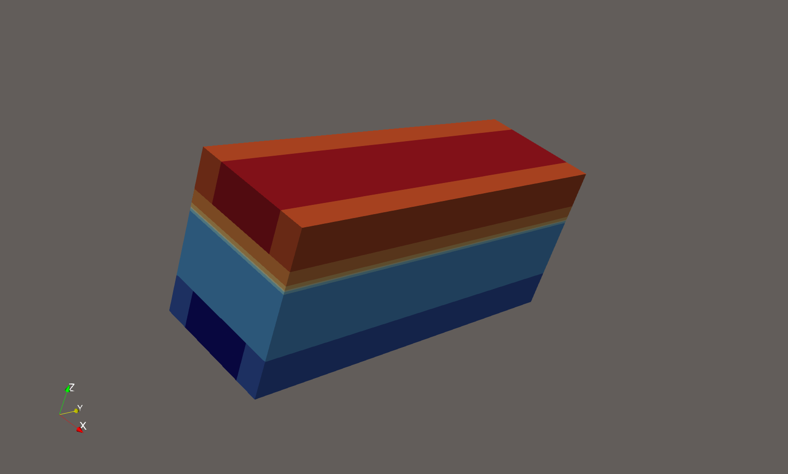

# The Effect of Metal Suport Degradation on the Performance of Solid Oxide Fuel Cell

# Introduction

This project develops a three-dimensional FEniCSx/DOLFINx model of a counter-flow MS-SOFC to study how oxidation of the porous metal support affects cell performance. The model couples gas transport, porous-media diffusion, electrochemical reaction, electric-potential transport, heat generation, and material-property degradation. The main goal is to quantify how degradation changes current density, voltage, power density, gas concentration, temperature, effective diffusivity, porosity, tortuosity, and electronic conductivity.

# Model Setup

The geometry represents a layered MS-SOFC with fuel and air channels, ribs, a porous metal support, an anode functional layer, electrolyte, cathode functional layer, and cathode porous layer.

The model uses the following geometric dimensions:

| Quantity | Meaning | Value |
|---|---:|---:|
| $$w_{\mathrm{rib}}$$ | rib width | $$200~\mu\mathrm{m}$$ |
| $$w_{\mathrm{channel}}$$ | channel width | $$600~\mu\mathrm{m}$$ |
| $$L_x$$ | total width | $$1000~\mu\mathrm{m}$$ |
| $$L_y$$ | flow length | $$3000~\mu\mathrm{m}$$ |
| $$h_{\mathrm{fuel}}$$ | fuel channel height | $$300~\mu\mathrm{m}$$ |
| $$h_{\mathrm{MS}}$$ | metal support thickness | $$500~\mu\mathrm{m}$$ |
| $$h_{\mathrm{AFL}}$$ | anode functional layer thickness | $$20~\mu\mathrm{m}$$ |
| $$h_{\mathrm{EL}}$$ | electrolyte thickness | $$10~\mu\mathrm{m}$$ |
| $$h_{\mathrm{CFL}}$$ | cathode functional layer thickness | $$30~\mu\mathrm{m}$$ |
| $$h_{\mathrm{cathode}}$$ | cathode porous layer thickness | $$100~\mu\mathrm{m}$$ |
| $$h_{\mathrm{air}}$$ | air channel height | $$300~\mu\mathrm{m}$$ |

The fuel and air streams flow in opposite directions. Fuel enters from one end of the channel and air enters from the other end.

The main simulation is solved on two reduced submeshes:

| Submesh | Included regions | Main variables solved |
|---|---|---|
| Fuel submesh | Fuel channel, metal support, anode functional layer | Hydrogen, water vapor, metal fraction, fuel-side temperature, electronic potential |
| Air submesh | Air channel, cathode porous layer, cathode functional layer | Oxygen, air-side temperature, ionic/electrolyte-side potential |

The anode functional layer and cathode functional layer are coupled by matching nearby cells in the horizontal plane. This allows the model to calculate one shared local current density for the anode and cathode reaction at each location.

The operating temperature is

$$
T_0 = 1073.15~\mathrm{K}
$$

The inlet fuel gas is humidified hydrogen:

$$
x_{\mathrm{H_2,in}}=0.97
$$

$$
x_{\mathrm{H_2O,in}}=0.03
$$

The air inlet oxygen mole fraction is:

$$
x_{\mathrm{O_2,in}}=0.21
$$
# Governing Equations

## Gas transport

$$
\frac{\partial c}{\partial t}+\mathbf{u}_f\cdot\nabla c=\nabla\cdot\left(D_{\mathrm{C}}\nabla c\right)+S
$$

The model tracks hydrogen and water vapor on the fuel side, and oxygen on the air side.

Hydrogen is consumed by the electrochemical reaction in the anode functional layer. Water vapor is produced by the electrochemical reaction, but it is also consumed by the metal-support oxidation reaction. Oxygen is consumed in the cathode functional layer.

Gas transport includes both advection and diffusion. Advection moves species with the gas flow, while diffusion moves species from high concentration regions to low concentration regions.

## Porous-media transport

$$
D_{\mathrm{eff}}=D_{\mathrm{bulk}}\frac{\varepsilon}{\tau}
$$

The metal support and electrode layers are porous, so gas does not move through them as freely as it does in open channels. The model accounts for this by using effective transport properties based on porosity and tortuosity.

When oxidation progresses, the metal support becomes less porous and more tortuous. This reduces the effective diffusivity of hydrogen and water vapor, which makes it harder for fuel to reach the active reaction layer.

$$
D(T)=D_{\mathrm{ref}}\left(\frac{T}{T_0}\right)^{1.75}
$$

The model can also include a Maxwell-Stefan-inspired correction and Knudsen diffusion. This improves the gas transport description by accounting for gas mixture composition, temperature, and pore size.

## Darcy flow

$$
\nabla\cdot\left(\frac{K}{\mu}\nabla p\right)=0
$$

The model uses pressure-driven Darcy flow.

Pressure is prescribed at the fuel and air inlets and outlets. The model then calculates the pressure field and uses it to compute the Darcy velocity. This velocity is used in the gas and heat transport equations.

This makes gas movement depend on permeability, viscosity, and pressure gradients. Since oxidation changes pore size and porosity, it also changes permeability and therefore affects gas flow.

## Metal-support oxidation

The model uses `theta_metal` to represent the remaining metallic fraction of the support.

- `theta_metal = 1` means fresh metallic support.
- `theta_metal = 0` means fully degraded support.

The oxidation degree is therefore `1 - theta_metal`.

In the current simplified model, oxidation is driven by local water vapor concentration. The oxidation reaction consumes water vapor and metal, and produces hydrogen. As oxidation proceeds, the remaining metal fraction decreases.

## Material degradation

Oxidation changes the material properties of the metal support.

As `theta_metal` decreases:

- porosity decreases,
- tortuosity increases,
- effective diffusivity decreases,
- pore radius decreases,
- permeability decreases,
- electronic conductivity decreases.

These changes create two main degradation pathways.

First, lower electronic conductivity increases electronic conduction loss and reduces local current. Second, lower porosity, diffusivity, and permeability weaken gas transport, which reduces local fuel availability and lowers electrochemical performance.

## Electronic and ionic potentials

$$
-\nabla\cdot\left(\sigma\nabla\phi\right)=q
$$

The model solves an electronic potential equation on the fuel submesh. This represents electron conduction through the metal support and anode-side conducting regions.

The model also solves a reduced ionic/electrolyte-side potential equation on the air submesh. This is used to represent the cathode-side/electrolyte-side potential involved in the local electrochemical reaction.

The difference between ionic and electronic potential gives the local operating voltage used by the electrochemical model.

## Electrochemical current

$$
i_{\mathrm{loc}}=2i_0\sinh\left(\frac{\alpha F\eta_{\mathrm{act}}}{RT}\right)
$$

The local current density is calculated using a Butler-Volmer-type relationship.

The model first uses the local gas concentrations and temperature to calculate the local Nernst voltage. It then compares this reversible voltage with the local operating voltage from the potential fields. The difference gives the activation overpotential, which drives the local current.

The same local current is used on the anode and cathode side, so hydrogen consumption, water production, and oxygen consumption remain coupled.

## Heat generation and temperature

$$
\rho c_p\frac{\partial T}{\partial t}+\rho c_p\mathbf{u}_f\cdot\nabla T=\nabla\cdot\left(k\nabla T\right)+Q$$

The model solves temperature on both the fuel and air submeshes.

Heat is generated from electrochemical losses. Larger current density and larger voltage losses produce more heat. The temperature field then affects gas transport, electrochemical reaction strength, and oxidation behavior.

The temperature is limited to a reasonable numerical range to avoid unstable early coupled simulations.

## Boundary conditions

At the fuel inlet, the model prescribes hydrogen concentration, water-vapor concentration, fuel-side temperature, and fuel pressure.

At the fuel outlet, the model prescribes pressure. Species and temperature use natural outflow/no-diffusive-flux conditions.

At the air inlet, the model prescribes oxygen concentration, air-side temperature, and air pressure.

At the air outlet, the model prescribes pressure. Oxygen and temperature use natural outflow/no-diffusive-flux conditions.

The electronic potential is fixed at the fuel-side collector reference. The ionic/electrolyte-side potential is fixed at the air-side collector reference.

